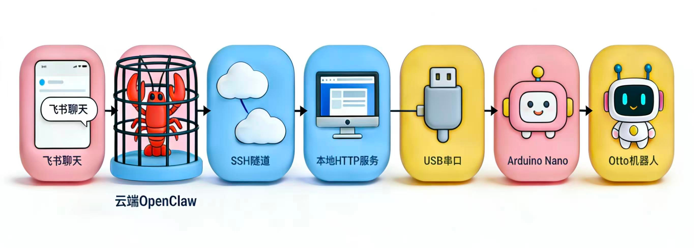

# OpenClaw Otto9 — AI Chat-Controlled Biped Robot

<p align="center">
  
</p>

> Control an Otto9 biped robot with natural language through Feishu (or any chat platform), powered by [OpenClaw](https://github.com/openclaw/openclaw) AI agent.
## ✨ Owner
This project is owned by Hu Yuan, with the help of Claude Opus!!!

## ✨ What is This?

This project lets you **talk to a robot in plain language**. Type "walk forward 3 steps" in Feishu chat → the AI agent translates it → sends a serial command → Otto walks.

The full signal path:

```
Feishu Chat → OpenClaw AI Agent → SSH Tunnel → HTTP Bridge → USB Serial → Arduino Nano → Otto9 Servos
 (cloud)        (cloud VPS)                     (local PC)                  (robot)
```

This is a **cloud-edge-device (云-边-端)** three-tier IoT architecture:

| Layer | Device | Role |
|-------|--------|------|
| **Cloud** | OpenClaw on VPS | AI agent: understands natural language, generates commands |
| **Edge** | Linux workstation | HTTP bridge + serial gateway, SSH tunnel to cloud |
| **Device** | Arduino Nano | Motor controller: drives servos and reads sensors |

## 📋 Hardware Requirements

| Component | Specification | Notes |
|-----------|--------------|-------|
| Otto9 Robot Kit | With 4× SG90 servos | Any Otto9-compatible kit |
| Arduino Nano | ATmega328P | Clone or original |
| USB Cable | Mini-USB / Micro-USB | Connects Nano to workstation |
| Battery Box | **4× AA (6V)** | ⚠️ 2×AA (3V) is NOT enough for SG90 servos |
| Linux Workstation | Any x86/ARM with Python 3 | Runs the HTTP bridge |
| Ultrasonic Sensor | HC-SR04 | Optional, for distance measurement |
| Buzzer | Passive buzzer | Pin 13 |

### ⚡ Power Warning

SG90 servos require **4.8–6V**. Two AA batteries (3V) will cause the Nano to reset when multiple servos move simultaneously. You need:
- **4× AA battery box (6V)** — connect to servo VCC/GND directly
- OR **5V 2A external power supply**

**Important:** Battery positive → servo VCC only. Battery negative → servo GND + Arduino GND (common ground). Do NOT feed battery voltage into Arduino 5V pin.

## 🔌 Pin Mapping

| Pin | Function |
|-----|----------|
| D2 | Right Hip Servo (YR) |
| D3 | Left Hip Servo (YL) |
| D4 | Right Foot Servo (RR) |
| D5 | Left Foot Servo (RL) |
| D6 | Ultrasonic Trigger |
| D7 | Ultrasonic Echo |
| D13 | Buzzer |
| A6 | Noise Sensor (optional) |

## 🛠️ Software Requirements

### On the workstation (edge device):
- Python 3.8+ with `pyserial`
- USB serial driver for Arduino Nano (usually `ch340` or `ftdi`)

### On the cloud VPS:
- [OpenClaw](https://github.com/openclaw/openclaw) installed and configured
- SSH access from workstation

### Build tools (for compiling firmware):
- `arduino-cli` 1.x+
- Arduino AVR core (`arduino:avr@1.8.7`)

## 🚀 Quick Start

### Step 1: Flash the Firmware

```bash
# Clone this repo
git clone https://github.com/YOUR_USERNAME/openclaw-otto9.git
cd openclaw-otto9

# Option A: Flash pre-built hex (fastest)
sudo avrdude -p atmega328p -c arduino -P /dev/ttyUSB0 -b 115200 \
  -U flash:w:firmware/build/otto_slave.ino.hex:i

# Option B: Compile from source
# Install arduino-cli first: https://arduino.github.io/arduino-cli/
arduino-cli core install arduino:avr@1.8.7
arduino-cli compile \
  --fqbn arduino:avr:nano:cpu=atmega328 \
  --libraries ./firmware/libraries/Libraries \
  firmware/otto_slave/otto_slave.ino
arduino-cli upload \
  --fqbn arduino:avr:nano:cpu=atmega328 \
  -p /dev/ttyUSB0 \
  firmware/otto_slave/otto_slave.ino
```

### Step 2: Test Serial Communication

```bash
# Quick test with the bridge script
pip install pyserial
python otto_bridge.py
```

In the interactive shell, type:
```
> PING
OK PONG

> HOME
OK

> BEEP
OK

> DIST
OK 42
```

If `PING` returns `OTTO9 READY` followed by `OK PONG`, the firmware is working.

### Step 3: Start the HTTP Bridge

```bash
# On the workstation
python otto_server.py
```

Test it:
```bash
curl "http://localhost:your port/health"
# {"status": "ok", ...}

curl "http://localhost:your port/cmd?q=PING"
# {"status": "ok", "value": null, "raw": ["OK PONG"]}

curl "http://localhost:your port/cmd?q=BEEP"
# {"status": "ok", "value": null, "raw": ["OK"]}
```

### Step 4: Set Up SSH Reverse Tunnel

On the workstation, open a terminal and run:
```bash
ssh -R port:localhost:port YOUR_USER@YOUR_VPS_IP -N
```

### Step 5: Install the OpenClaw Skill

Copy the `skill/` directory to your OpenClaw workspace:
```bash
cp -r skill/ ~/.openclaw/workspace/otto-robot/skill/
```

Register it in your OpenClaw config or workspace. The skill file (`skill/SKILL.md`) teaches the AI agent how to translate natural language into Otto commands.

### Step 6: Chat!

Open Feishu (or your configured chat platform) and talk to your OpenClaw agent:

- "让Otto叫一声" → `BEEP`
- "测一下距离" → `DIST`
- "弯一下左腿" → `BEND 1 LEFT`
- "往前走3步" → `WALK 3` (needs 4×AA battery!)

## 📁 Project Structure

```
openclaw-otto9/
├── README.md                 # This file
├── firmware/
│   ├── otto_slave/
│   │   └── otto_slave.ino    # Arduino firmware (text command protocol)
│   ├── build/
│   │   └── otto_slave.ino.hex  # Pre-built hex for direct flashing
│   └── libraries/
│       └── Libraries/        # Otto9 V9 library (Servo_T, US, Otto9, etc.)
├── otto_bridge.py            # Interactive serial bridge (for testing)
├── otto_server.py            # HTTP-to-serial bridge server (port 8266)
├── skill/
│   └── SKILL.md              # OpenClaw agent skill definition
└── docs/
    └── architecture.png      # Architecture diagram (TODO)
```

## 📡 Command Protocol

The firmware uses a simple text-based serial protocol at **115200 baud**.

On startup, the Arduino sends: `OTTO9 READY`

### Command Reference

| Command | Parameters | Description | Needs Battery? |
|---------|-----------|-------------|----------------|
| `PING` | — | Connectivity test, returns `OK PONG` | No |
| `HOME` | — | All servos to 90° neutral | No |
| `WALK` | `[steps]` | Walk forward (default 2 steps) | **Yes** |
| `WALKBACK` | `[steps]` | Walk backward | **Yes** |
| `TURNLEFT` | `[steps]` | Turn left | **Yes** |
| `TURNRIGHT` | `[steps]` | Turn right | **Yes** |
| `BEND` | `steps LEFT\|RIGHT` | Bend one leg | Low power OK |
| `MOONWALK` | `[steps]` | Moonwalk dance | **Yes** |
| `SWING` | `[steps]` | Swing dance | **Yes** |
| `FLAPPING` | `[steps]` | Flapping motion | **Yes** |
| `JITTER` | `[steps]` | Jitter motion | **Yes** |
| `CRUSAITO` | `[steps]` | Crusaito dance | **Yes** |
| `TIPTOE` | `[steps]` | Tiptoe walk | **Yes** |
| `JUMP` | — | Jump | **Yes** |
| `GESTURE` | `id` | Gesture (0=happy, 1=superhappy, 2=sad) | **Yes** (with sound) |
| `DIST` | — | Read ultrasonic distance (cm) | No |
| `BEEP` | — | Play a tone | No |

### Response Format

- Success: `OK [optional_value]`
- Error: `ERR [message]`

Example:
```
> DIST
OK 42       ← 42 cm distance

> WALK 3
OK          ← walked 3 steps

> BLAH
ERR UNKNOWN_CMD
```

## 🔧 Debugging Guide

### Problem: PING returns nothing
1. Check USB cable connection
2. Check serial port: `ls /dev/ttyUSB*` or `ls /dev/ttyACM*`
3. Check baud rate is 115200
4. Try pressing reset button on Nano — you should see `OTTO9 READY`

### Problem: PING returns `OTTO9 READY` twice
The Nano is resetting! This means a power issue:
- If using USB only: multi-servo commands will cause reset
- Fix: connect 4×AA battery box to servo power

### Problem: WALK causes Nano to reset
**This is a power issue.** USB provides max 500mA, but 4 SG90 servos need 800mA–1A peak.
- Low-power commands work fine: `PING`, `HOME`, `BEND`, `DIST`, `BEEP`
- Multi-servo commands need external power: `WALK`, `TURN`, `MOONWALK`, etc.

### Problem: Serial port permission denied
```bash
sudo usermod -a -G dialout $USER
# Log out and back in
```

### Problem: `otto_server.py` can't open serial port
- Check if another program is using the port
- Check the port path in `otto_server.py` (default: `/dev/ttyUSB0`)
- Try: `python otto_server.py`  and check error messages

## 🏗️ Architecture Deep Dive

### Why Three Layers?

Traditional robot control uses two layers (host + controller). We add a cloud AI layer:

1. **Arduino Nano (Device)** — Real-time motor control. Handles PWM signals, sensor reads. Simple and reliable.

2. **Linux Workstation (Edge)** — Bridges the physical world and the internet. Converts HTTP requests to serial commands. Runs locally for low latency.

3. **OpenClaw on VPS (Cloud)** — AI brain. Understands "让机器人跳个舞" (make the robot dance) and translates it to `MOONWALK 4`. Connected to chat platforms (Feishu, Telegram, etc.).

### Why Not Connect Arduino Directly to Cloud?

- Arduino Nano has no network capability
- Even with WiFi (ESP32), you'd need a local gateway for serial
- The workstation provides reliable USB-serial and can run complex bridge logic

### Security

- SSH tunnel encrypts all traffic between cloud and workstation
- No ports exposed on the workstation
- The HTTP bridge only listens on localhost

## 📝 Cost Estimate

| Item | Price (CNY) |
|------|-------------|
| Otto9 Kit (servos + frame) | ~60 |
| Arduino Nano (clone) | ~15 |
| HC-SR04 Ultrasonic | ~5 |
| Buzzer | ~2 |
| 4×AA Battery Box + Batteries | ~15 |
| Jumper Wires | ~5 |
| USB Cable | ~5 |
| **Total** | **~107** |

Linux workstation and VPS not included (use what you have).

## 🙏 Credits

- [Otto DIY](https://www.ottodiy.com/) — Original Otto robot design
- [OpenClaw](https://github.com/openclaw/openclaw) — AI agent framework
- Otto9 Libraries V9 — Servo control and gesture library
- Built for the **上海创客新星大赛** (Shanghai Maker Rising Star Competition)

## 📄 License

MIT License. See [LICENSE](LICENSE) for details.

---

*Built with 🦐 by a shrimp and her human friends.*
